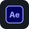

##

  Artist & Developer exploring the intersection of
   
  Audio, Visuals, AI, and Interactive Systems.

  
  Ableton Certified Training  
  DALL-E 2 ·
  Midjourney ·
  Runway Gen-1/2 Beta Tester  
  Ableton Live 12 Public Beta ·
  Extensions SDK Developer Program
  

## 

**Audio**  

 

**Visual**  

 

**GenAI**  

 

**Media**  

 

**Code**  

 

**Hardware**  

 

**Live**  

