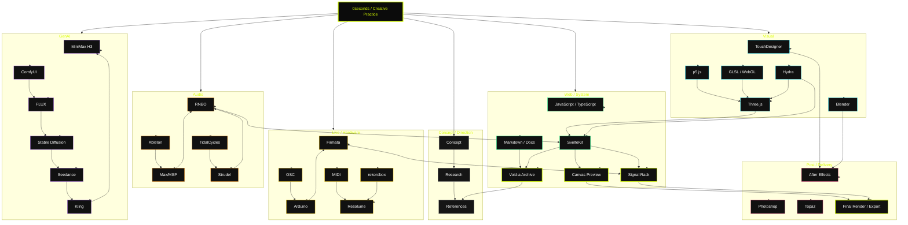

```mermaid

flowchart TD
    ROOT["0seconds / Creative Practice"]

    subgraph IDEA["Concept / Direction"]
        CONCEPT["Concept"]
        RESEARCH["Research"]
        REFS["References"]
    end

    subgraph AUDIO["Audio"]
        ABLETON["Ableton"]
        MAX["Max/MSP"]
        STRUDEL["Strudel"]
        TIDAL["TidalCycles"]
        RNBO["RNBO"]
    end

    subgraph VISUAL["Visual"]
        TD["TouchDesigner"]
        BLENDER["Blender"]
        P5["p5.js"]
        GLSL["GLSL / WebGL"]
        THREE["Three.js"]
        HYDRA["Hydra"]
    end

    subgraph AI["GenAI"]
        COMFY["ComfyUI"]
        FLUX["FLUX"]
        SD["Stable Diffusion"]
        SEED["Seedance"]
        KLING["Kling"]
        H3["MiniMax H3"]
    end

    subgraph MEDIA["Post / Delivery"]
        AE["After Effects"]
        PS["Photoshop"]
        TOPAZ["Topaz"]
        RENDER["Final Render / Export"]
    end

    subgraph WEB["Web / System"]
        SVELTE["SvelteKit"]
        JS["JavaScript / TypeScript"]
        MD["Markdown / Docs"]
        ARCHIVE["Void-a Archive"]
        CANDY["Canvas Preview"]
        SIGNAL["Signal Rack"]
    end

    subgraph LIVE["Live / Hardware"]
        OSC["OSC"]
        MIDI["MIDI"]
        ARDUINO["Arduino"]
        FIRMATA["Firmata"]
        RESOLUME["Resolume"]
        REKORDBOX["rekordbox"]
    end

    ROOT --> CONCEPT
    ROOT --> AUDIO
    ROOT --> VISUAL
    ROOT --> AI
    ROOT --> WEB
    ROOT --> LIVE

    CONCEPT --> RESEARCH
    RESEARCH --> REFS

    AUDIO --> ABLETON
    AUDIO --> MAX
    AUDIO --> STRUDEL
    AUDIO --> TIDAL
    AUDIO --> RNBO

    VISUAL --> TD
    VISUAL --> BLENDER
    VISUAL --> P5
    VISUAL --> GLSL
    VISUAL --> THREE
    VISUAL --> HYDRA

    AI --> COMFY
    AI --> FLUX
    AI --> SD
    AI --> SEED
    AI --> KLING
    AI --> H3

    MEDIA --> AE
    MEDIA --> PS
    MEDIA --> TOPAZ
    MEDIA --> RENDER

    WEB --> SVELTE
    WEB --> JS
    WEB --> MD
    WEB --> ARCHIVE
    WEB --> CANDY
    WEB --> SIGNAL

    LIVE --> OSC
    LIVE --> MIDI
    LIVE --> ARDUINO
    LIVE --> FIRMATA
    LIVE --> RESOLUME
    LIVE --> REKORDBOX

    ABLETON --> MAX
    MAX --> RNBO
    TIDAL --> STRUDEL
    STRUDEL --> RNBO

    COMFY --> FLUX
    FLUX --> SD
    SD --> SEED
    SEED --> KLING
    KLING --> H3

    TD --> AE
    BLENDER --> AE
    P5 --> THREE
    GLSL --> THREE
    HYDRA --> THREE

    RNBO --> SVELTE
    THREE --> SVELTE
    HYDRA --> SVELTE
    MD --> ARCHIVE

    SVELTE --> CANDY
    SVELTE --> SIGNAL
    SVELTE --> ARCHIVE

    OSC --> ARDUINO
    MIDI --> RESOLUME
    ARDUINO --> FIRMATA
    FIRMATA --> SIGNAL
    REKORDBOX --> RESOLUME

    CANDY --> RENDER
    SIGNAL --> RENDER
    ARCHIVE --> REFS

    classDef root fill:#0b0b0b,stroke:#d9ff00,color:#d9ff00,stroke-width:3px;
    classDef concept fill:#151515,stroke:#8b8b8b,color:#ffffff;
    classDef audio fill:#111111,stroke:#ff8a00,color:#ffffff;
    classDef visual fill:#111111,stroke:#00d9ff,color:#ffffff;
    classDef ai fill:#111111,stroke:#b56cff,color:#ffffff;
    classDef media fill:#111111,stroke:#ff4d8d,color:#ffffff;
    classDef web fill:#111111,stroke:#00ff88,color:#ffffff;
    classDef live fill:#111111,stroke:#ffcc00,color:#ffffff;
    classDef output fill:#111111,stroke:#d9ff00,color:#ffffff,stroke-width:2px;

    class ROOT root;
    class CONCEPT,RESEARCH,REFS concept;

    class ABLETON,MAX,STRUDEL,TIDAL,RNBO audio;
    class TD,BLENDER,P5,GLSL,THREE,HYDRA visual;
    class COMFY,FLUX,SD,SEED,KLING,H3 ai;
    class AE,PS,TOPAZ,RENDER media;
    class SVELTE,JS,MD,ARCHIVE,CANDY,SIGNAL web;
    class OSC,MIDI,ARDUINO,FIRMATA,RESOLUME,REKORDBOX live;

    class RENDER,CANDY,SIGNAL,ARCHIVE output;

```
