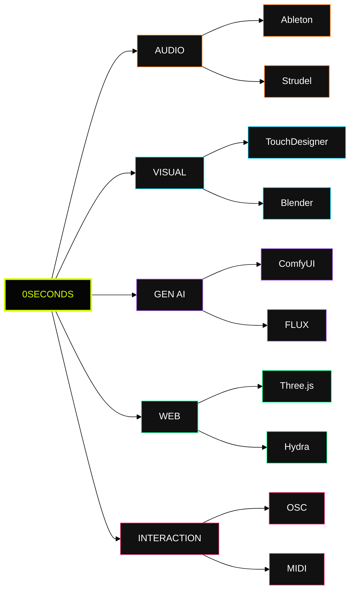

```mermaid
---
config:
  theme: base
---

flowchart LR
    ROOT["0SECONDS"]

    AUDIO["AUDIO"]
    VISUAL["VISUAL"]
    AI["GEN AI"]
    WEB["WEB"]
    INTERACTION["INTERACTION"]

    ROOT --> AUDIO
    ROOT --> VISUAL
    ROOT --> AI
    ROOT --> WEB
    ROOT --> INTERACTION

    AUDIO --> ABLETON["Ableton"]
    AUDIO --> STRUDEL["Strudel"]

    VISUAL --> TD["TouchDesigner"]
    VISUAL --> BLENDER["Blender"]

    AI --> COMFY["ComfyUI"]
    AI --> FLUX["FLUX"]

    WEB --> THREE["Three.js"]
    WEB --> HYDRA["Hydra"]

    INTERACTION --> OSC["OSC"]
    INTERACTION --> MIDI["MIDI"]

    classDef root fill:#050505,stroke:#d9ff00,color:#d9ff00,stroke-width:3px;
    classDef audio fill:#111111,stroke:#ff6b00,color:#ffffff;
    classDef visual fill:#111111,stroke:#00d9ff,color:#ffffff;
    classDef ai fill:#111111,stroke:#b86cff,color:#ffffff;
    classDef web fill:#111111,stroke:#00ff88,color:#ffffff;
    classDef interaction fill:#111111,stroke:#ff3b81,color:#ffffff;

    class ROOT root;
    class AUDIO,ABLETON,STRUDEL audio;
    class VISUAL,TD,BLENDER visual;
    class AI,COMFY,FLUX ai;
    class WEB,THREE,HYDRA web;
    class INTERACTION,OSC,MIDI interaction;
```
