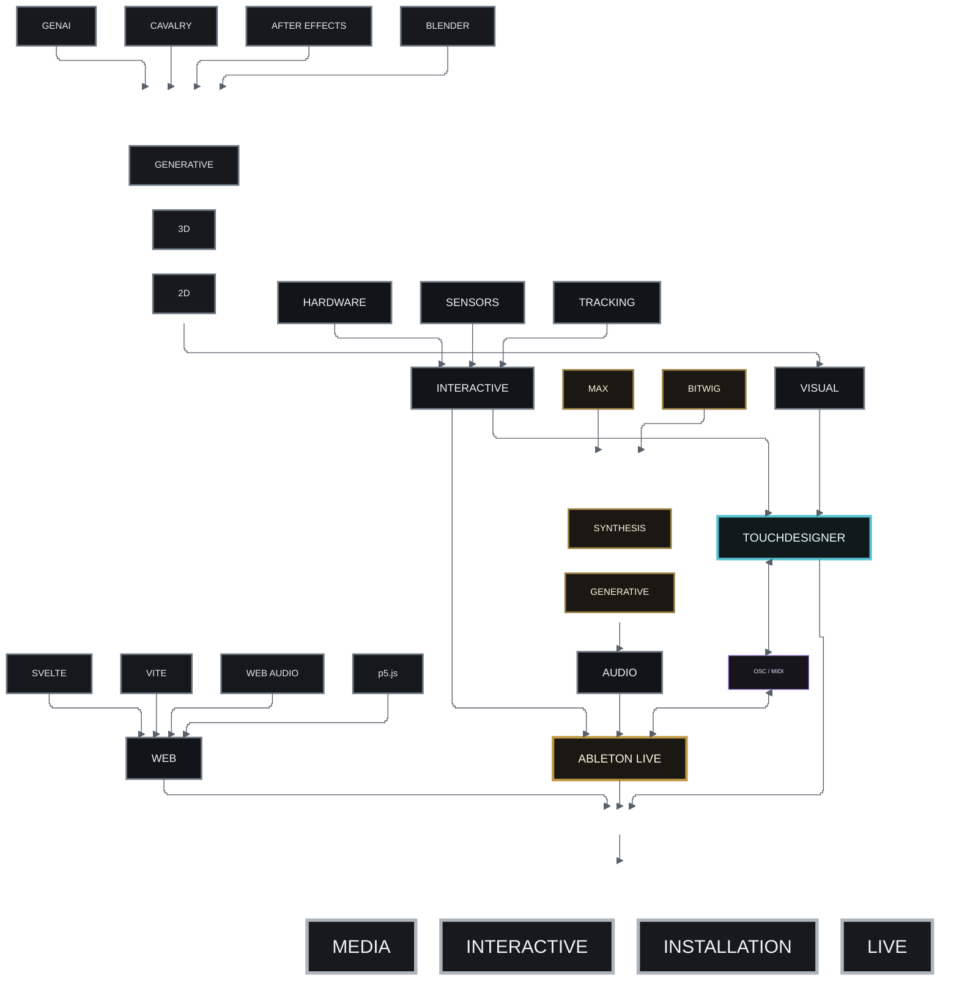

```mermaid

---
config:
  layout: elk
  elk:
    nodePlacementStrategy: BRANDES_KOEPF
    mergeEdges: false
  theme: base
  themeVariables:
    background: "#0d0f12"
    primaryColor: "#15181d"
    primaryTextColor: "#d7dbe0"
    primaryBorderColor: "#303640"
    lineColor: "#59616b"
    fontFamily: "Arial, Helvetica, sans-serif"
    fontSize: "13px"
  flowchart:
    curve: step
    nodeSpacing: 100
    rankSpacing: 100
---

flowchart TD

    %% =========================================================
    %% INPUT SOURCES
    %% =========================================================

    GENAI["GENAI"] & CAVALRY["CAVALRY"] & AE["AFTER EFFECTS"] & BLENDER["BLENDER"] --> VISUAL_METHOD
    
    HARDWARE["HARDWARE"] & SENSORS["SENSORS"] & TRACKING["TRACKING"] --> INTERACTIVE["INTERACTIVE"]
    
    MAX["MAX"] & BITWIG["BITWIG"] --> AUDIO_METHOD
    
    SVELTE["SVELTE"] & VITE["VITE"] & WEB_AUDIO["WEB AUDIO"] & P5["p5.js"] --> WEB["WEB"]

    %% =========================================================
    %% METHODS (Subgraphs)
    %% =========================================================

    subgraph VISUAL_METHOD[" "]
        direction TB
        VISUAL_GENERATIVE["GENERATIVE"]
        VISUAL_3D["3D"]
        VISUAL_2D["2D"]
        VISUAL_GENERATIVE ~~~ VISUAL_3D ~~~ VISUAL_2D
    end
    VISUAL_METHOD --> VISUAL["VISUAL"]

    subgraph AUDIO_METHOD[" "]
        direction TB
        AUDIO_SYNTHESIS["SYNTHESIS"]
        AUDIO_GENERATIVE["GENERATIVE"]
        AUDIO_SYNTHESIS ~~~ AUDIO_GENERATIVE
    end
    AUDIO_METHOD --> AUDIO["AUDIO"]

    %% =========================================================
    %% CORE SYSTEM
    %% =========================================================

    VISUAL --> TD["TOUCHDESIGNER"]
    INTERACTIVE --> TD
    INTERACTIVE --> ABLETON["ABLETON LIVE"]
    AUDIO --> ABLETON

    %% OSC/MIDI Communication bridging TD and Ableton
    TD <--> MID["OSC / MIDI"] <--> ABLETON

    %% =========================================================
    %% SIGNAL CONVERGENCE
    %% =========================================================

    TD --> SIGNAL[" "]
    ABLETON --> SIGNAL
    WEB --> SIGNAL

    %% =========================================================
    %% OUTPUT
    %% =========================================================

    SIGNAL --> OUTPUT

    subgraph OUTPUT[" "]
        direction LR
        MEDIA["MEDIA"]
        INTERACTIVE_OUT["INTERACTIVE"]
        INSTALLATION["INSTALLATION"]
        LIVE["LIVE"]
        MEDIA ~~~ INTERACTIVE_OUT ~~~ INSTALLATION ~~~ LIVE
    end

    %% =========================================================
    %% HIDDEN STYLES
    %% =========================================================

    style VISUAL_METHOD fill:none,stroke:none
    style AUDIO_METHOD fill:none,stroke:none
    style OUTPUT fill:none,stroke:none
    style SIGNAL fill:none,stroke:none

    %% =========================================================
    %% COMPONENT STYLES
    %% =========================================================

    classDef domain fill:#111419,stroke:#737b84,color:#f0f2f4,stroke-width:2px,font-size:13px;
    classDef visualTool fill:#17191d,stroke:#69747e,color:#e6eaed,stroke-width:2px,font-size:11px;
    classDef visualMethod fill:#17191d,stroke:#69747e,color:#e6eaed,stroke-width:2px,font-size:11px;
    classDef audioTool fill:#191813,stroke:#9c8245,color:#fff7df,stroke-width:2px,font-size:11px;
    classDef audioMethod fill:#191813,stroke:#9c8245,color:#fff7df,stroke-width:2px,font-size:11px;
    classDef coreTD fill:#10191b,stroke:#55c3d2,color:#eefbfc,stroke-width:3px,font-size:14px;
    classDef coreAudio fill:#191813,stroke:#c19a45,color:#fff7df,stroke-width:3px,font-size:14px;
    classDef communication fill:#16151b,stroke:#9b7bd3,color:#eee8ff,stroke-width:1px,font-size:7px;
    classDef webTool fill:#15181d,stroke:#69747e,color:#e6eaed,stroke-width:2px,font-size:11px;
    classDef output fill:#17191d,stroke:#aeb5bd,color:#f1f3f5,stroke-width:4px,font-size:22px;

    class VISUAL,AUDIO,INTERACTIVE,WEB domain;
    class GENAI,CAVALRY,AE,BLENDER visualTool;
    class VISUAL_GENERATIVE,VISUAL_3D,VISUAL_2D visualMethod;
    class MAX,BITWIG audioTool;
    class AUDIO_SYNTHESIS,AUDIO_GENERATIVE audioMethod;
    class HARDWARE,SENSORS,TRACKING domain;
    class SVELTE,VITE,WEB_AUDIO,P5 webTool;
    class TD coreTD;
    class ABLETON coreAudio;
    class MID communication;
    class MEDIA,INTERACTIVE_OUT,INSTALLATION,LIVE output;

```
