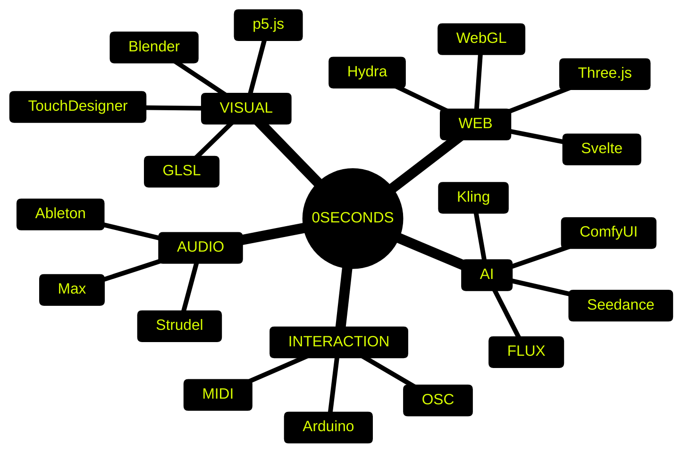

```mermaid
---
config:
  theme: base
  themeVariables:
    primaryColor: "#0a0a0a"
    primaryTextColor: "#d9ff00"
    primaryBorderColor: "#d9ff00"
    lineColor: "#444444"
    secondaryColor: "#151515"
    tertiaryColor: "#202020"
    fontFamily: "monospace"
---

mindmap
  root((0SECONDS))
    AUDIO
      Ableton
      Max
      Strudel
    VISUAL
      TouchDesigner
      Blender
      p5.js
      GLSL
    AI
      ComfyUI
      FLUX
      Seedance
      Kling
    WEB
      Svelte
      WebGL
      Three.js
      Hydra
    INTERACTION
      OSC
      MIDI
      Arduino
```
