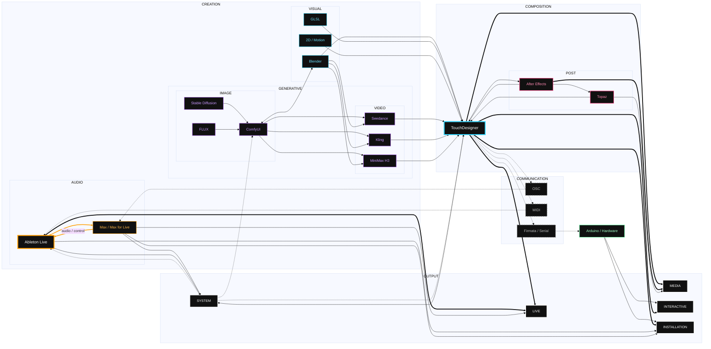

```mermaid

---
config:
  flowchart:
    curve: basis
    nodeSpacing: 38
    rankSpacing: 70
  theme: base
---

flowchart LR

    %% =========================================================
    %% CREATION
    %% =========================================================

    subgraph CREATION["CREATION"]

        subgraph AUDIO["AUDIO"]
            ABLETON["Ableton Live"]
            MAX["Max / Max for Live"]
        end

        subgraph VISUAL["VISUAL"]
            BLENDER["Blender"]
            GLSL["GLSL"]
            MOTION["2D / Motion"]
        end

        subgraph GENERATIVE["GENERATIVE"]

            subgraph IMAGE["IMAGE"]
                COMFY["ComfyUI"]
                SD["Stable Diffusion"]
                FLUX["FLUX"]
            end

            subgraph VIDEO["VIDEO"]
                SEEDANCE["Seedance"]
                KLING["Kling"]
                H3["MiniMax H3"]
            end

        end

    end


    %% =========================================================
    %% CORE COMPOSITION
    %% =========================================================

    subgraph COMPOSITION["COMPOSITION"]

        TD["TouchDesigner"]

        subgraph POST["POST"]
            AE["After Effects"]
            TOPAZ["Topaz"]
        end

    end


    %% =========================================================
    %% COMMUNICATION
    %% =========================================================

    subgraph COMMUNICATION["COMMUNICATION"]

        OSC["OSC"]
        MIDI["MIDI"]
        FIRMATA["Firmata / Serial"]

    end


    %% =========================================================
    %% HARDWARE
    %% =========================================================

    HARDWARE["Arduino / Hardware"]


    %% =========================================================
    %% OUTPUT
    %% =========================================================

    subgraph OUTPUT["OUTPUT"]

        MEDIA["MEDIA"]
        INTERACTIVE["INTERACTIVE"]
        INSTALLATION["INSTALLATION"]
        LIVE["LIVE"]
        SYSTEM["SYSTEM"]

    end


    %% =========================================================
    %% AUDIO CORE
    %% =========================================================

    ABLETON <--> MAX

    MAX ==>|audio / control| ABLETON


    %% =========================================================
    %% VISUAL → TD
    %% =========================================================

    BLENDER --> TD
    GLSL --> TD
    MOTION --> TD


    %% =========================================================
    %% GENERATIVE
    %% =========================================================

    SD --> COMFY
    FLUX --> COMFY

    COMFY <--> BLENDER

    COMFY --> SEEDANCE
    COMFY --> KLING
    COMFY --> H3

    BLENDER --> SEEDANCE
    BLENDER --> KLING
    BLENDER --> H3

    SEEDANCE --> TD
    KLING --> TD
    H3 --> TD


    %% =========================================================
    %% POST LOOP
    %% =========================================================

    TD --> AE
    AE --> TOPAZ

    TOPAZ --> TD
    AE --> TD


    %% =========================================================
    %% CORE ↔ COMMUNICATION
    %% =========================================================

    TD -.-> OSC
    OSC -.-> MAX

    TD -.-> MIDI
    MIDI -.-> ABLETON

    TD -.-> FIRMATA
    FIRMATA -.-> HARDWARE


    %% =========================================================
    %% HARDWARE → EXPERIENCE
    %% =========================================================

    HARDWARE --> INTERACTIVE
    HARDWARE --> INSTALLATION


    %% =========================================================
    %% OUTPUT
    %% =========================================================

    TD ==> MEDIA
    AE ==> MEDIA
    TOPAZ --> MEDIA

    TD ==> INTERACTIVE

    TD ==> INSTALLATION
    ABLETON --> INSTALLATION
    MAX --> INSTALLATION

    TD ==> LIVE
    ABLETON ==> LIVE
    MAX --> LIVE

    TD --> SYSTEM
    MAX --> SYSTEM
    ABLETON --> SYSTEM


    %% =========================================================
    %% SYSTEM FEEDBACK
    %% =========================================================

    SYSTEM -.-> COMFY
    SYSTEM -.-> TD
    SYSTEM -.-> ABLETON


    %% =========================================================
    %% STYLES
    %% =========================================================

    classDef audio fill:#111,stroke:#ff9d00,color:#ffb84d,stroke-width:1.5px;
    classDef visual fill:#111,stroke:#36d7ff,color:#6fe4ff,stroke-width:1.5px;
    classDef ai fill:#111,stroke:#b66cff,color:#c99aff,stroke-width:1.5px;

    classDef coreTD fill:#111,stroke:#36d7ff,color:#fff,stroke-width:4px,font-size:18px;
    classDef coreAudio fill:#111,stroke:#ff9d00,color:#fff,stroke-width:4px,font-size:18px;

    classDef post fill:#111,stroke:#ff4d8d,color:#ff8ab3,stroke-width:2px;
    classDef communication fill:#111,stroke:#777,color:#bbb,stroke-width:2px,stroke-dasharray:5 5;
    classDef hardware fill:#111,stroke:#7cffb2,color:#a5ffc8,stroke-width:2px;

    classDef output fill:#111,stroke:#fff,color:#fff,stroke-width:2px,font-size:15px;


    %% Apply classes

    class ABLETON coreAudio;
    class MAX audio;

    class TD coreTD;

    class BLENDER,GLSL,MOTION visual;
    class COMFY,SD,FLUX,SEEDANCE,KLING,H3 ai;

    class AE,TOPAZ post;

    class OSC,MIDI,FIRMATA communication;
    class HARDWARE hardware;

    class MEDIA,INTERACTIVE,INSTALLATION,LIVE,SYSTEM output;


    %% Link emphasis

    linkStyle 0,1 stroke:#ff9d00,stroke-width:3px;


```
