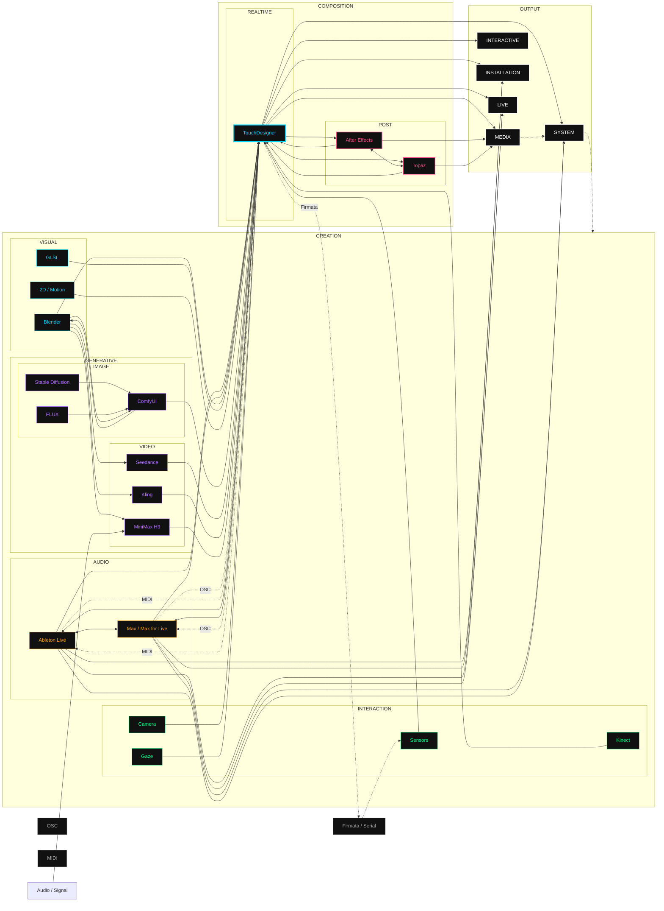

```mermaid

flowchart LR

    %% =========================
    %% CREATION
    %% =========================

    subgraph CREATION["CREATION"]

        subgraph AUDIO["AUDIO"]
            ABLETON["Ableton Live"]
            MAX["Max / Max for Live"]
        end

        subgraph VISUAL["VISUAL"]
            BLENDER["Blender"]
            GLSL["GLSL"]
            MOTION["2D / Motion"]
        end

        subgraph GENERATIVE["GENERATIVE"]

            subgraph IMAGE["IMAGE"]
                COMFY["ComfyUI"]
                SD["Stable Diffusion"]
                FLUX["FLUX"]
            end

            subgraph VIDEO["VIDEO"]
                SEEDANCE["Seedance"]
                KLING["Kling"]
                H3["MiniMax H3"]
            end

        end

        subgraph INTERACTION["INTERACTION"]
            KINECT["Kinect"]
            CAMERA["Camera"]
            GAZE["Gaze"]
            SENSORS["Sensors"]
        end

    end


    %% =========================
    %% COMPOSITION
    %% =========================

    subgraph COMPOSITION["COMPOSITION"]

        subgraph REALTIME["REALTIME"]
            TD["TouchDesigner"]
        end

        subgraph POST["POST"]
            AE["After Effects"]
            TOPAZ["Topaz"]
        end

    end


    %% =========================
    %% OUTPUT
    %% =========================

    subgraph OUTPUT["OUTPUT"]

        MEDIA["MEDIA"]
        INTERACTIVE_OUT["INTERACTIVE"]
        INSTALLATION["INSTALLATION"]
        LIVE["LIVE"]
        SYSTEM["SYSTEM"]

    end


    %% =========================
    %% CREATION → COMPOSITION
    %% =========================

    ABLETON <--> MAX

    ABLETON --> TD
    MAX --> TD
    TD --> ABLETON
    TD --> MAX

    BLENDER --> TD
    GLSL --> TD
    MOTION --> TD

    COMFY --> TD
    SD --> COMFY
    FLUX --> COMFY

    COMFY --> BLENDER
    BLENDER --> COMFY

    SEEDANCE --> TD
    KLING --> TD
    H3 --> TD

    BLENDER --> SEEDANCE
    BLENDER --> KLING
    BLENDER --> H3

    AUDIO_SIGNAL["Audio / Signal"] --> H3

    KINECT --> TD
    CAMERA --> TD
    GAZE --> TD
    SENSORS --> TD


    %% =========================
    %% REALTIME ↔ POST
    %% =========================

    TD --> AE
    AE --> TD

    TD --> TOPAZ
    TOPAZ --> TD

    AE <--> TOPAZ


    %% =========================
    %% COMPOSITION → OUTPUT
    %% =========================

    TD --> MEDIA
    AE --> MEDIA
    TOPAZ --> MEDIA

    TD --> INTERACTIVE_OUT
    TD --> INSTALLATION
    TD --> LIVE

    ABLETON --> LIVE
    MAX --> LIVE

    ABLETON --> INSTALLATION
    MAX --> INSTALLATION

    TD --> SYSTEM
    MAX --> SYSTEM
    ABLETON --> SYSTEM


    %% =========================
    %% OUTPUT FEEDBACK
    %% =========================

    MEDIA -.-> SYSTEM
    SYSTEM -.-> CREATION


    %% =========================
    %% COMMUNICATION
    %% =========================

    OSC["OSC"]
    MIDI["MIDI"]
    FIRMATA["Firmata / Serial"]

    TD -. OSC .-> MAX
    MAX -. OSC .-> TD

    TD -. MIDI .-> ABLETON
    ABLETON -. MIDI .-> TD

    TD -. Firmata .-> FIRMATA
    FIRMATA -.-> SENSORS


    %% =========================
    %% STYLES
    %% =========================

    classDef creation fill:#111,stroke:#888,color:#fff;
    classDef audio fill:#111,stroke:#ff9d00,color:#ff9d00;
    classDef visual fill:#111,stroke:#00d9ff,color:#00d9ff;
    classDef ai fill:#111,stroke:#b56cff,color:#b56cff;
    classDef interaction fill:#111,stroke:#00ff88,color:#00ff88;

    classDef realtime fill:#111,stroke:#00d9ff,stroke-width:3px,color:#00d9ff;
    classDef post fill:#111,stroke:#ff4d8d,stroke-width:2px,color:#ff4d8d;

    classDef output fill:#111,stroke:#fff,stroke-width:2px,color:#fff;
    classDef communication fill:#111,stroke:#777,color:#aaa;

    class ABLETON,MAX audio;
    class BLENDER,GLSL,MOTION visual;
    class COMFY,SD,FLUX,SEEDANCE,KLING,H3 ai;
    class KINECT,CAMERA,GAZE,SENSORS interaction;

    class TD realtime;
    class AE,TOPAZ post;

    class MEDIA,INTERACTIVE_OUT,INSTALLATION,LIVE,SYSTEM output;

    class OSC,MIDI,FIRMATA communication;

```
