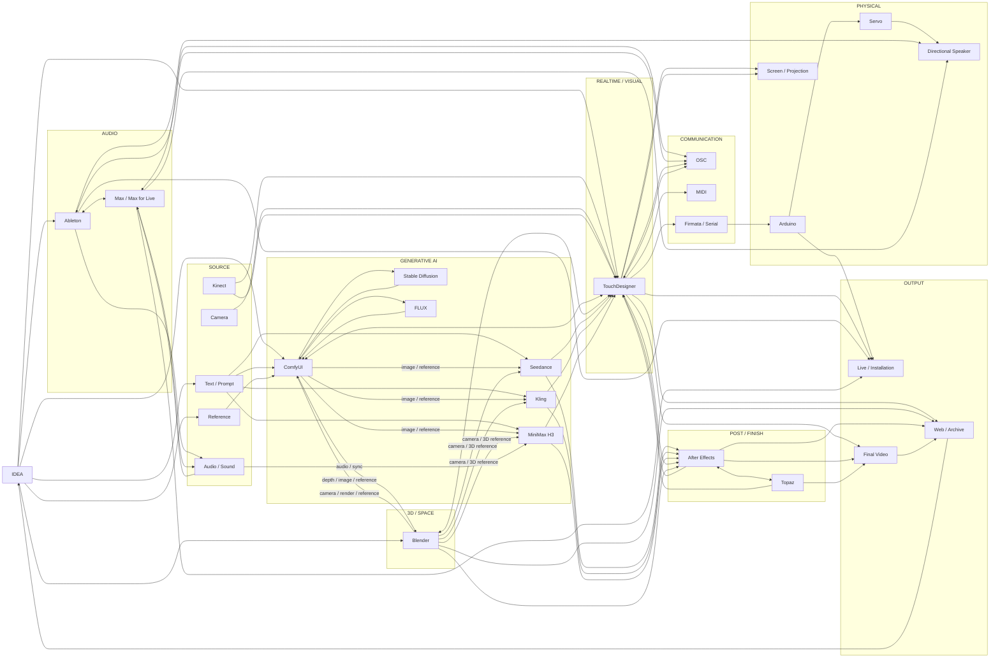

```mermaid

flowchart LR

    IDEA["IDEA"]

    subgraph SOURCE["SOURCE"]
        KINECT["Kinect"]
        CAMERA["Camera"]
        TEXT["Text / Prompt"]
        AUDIO_SRC["Audio / Sound"]
        REFERENCE["Reference"]
    end

    subgraph AUDIO["AUDIO"]
        ABLETON["Ableton"]
        MAX["Max / Max for Live"]
    end

    subgraph REALTIME["REALTIME / VISUAL"]
        TD["TouchDesigner"]
    end

    subgraph GENAI["GENERATIVE AI"]
        COMFY["ComfyUI"]
        SD["Stable Diffusion"]
        FLUX["FLUX"]

        SEEDANCE["Seedance"]
        KLING["Kling"]
        H3["MiniMax H3"]
    end

    subgraph THREE_D["3D / SPACE"]
        BLENDER["Blender"]
    end

    subgraph POST["POST / FINISH"]
        AE["After Effects"]
        TOPAZ["Topaz"]
    end

    subgraph COMM["COMMUNICATION"]
        OSC["OSC"]
        MIDI["MIDI"]
        FIRMATA["Firmata / Serial"]
    end

    subgraph PHYSICAL["PHYSICAL"]
        ARDUINO["Arduino"]
        SERVO["Servo"]
        SPEAKER["Directional Speaker"]
        SCREEN["Screen / Projection"]
    end

    subgraph OUTPUT["OUTPUT"]
        WEB["Web / Archive"]
        LIVE["Live / Installation"]
        VIDEO["Final Video"]
    end


    %% IDEA / SOURCE
    IDEA --> TEXT
    IDEA --> REFERENCE
    IDEA --> ABLETON
    IDEA --> TD
    IDEA --> COMFY
    IDEA --> BLENDER

    KINECT --> TD
    CAMERA --> TD
    AUDIO_SRC --> MAX


    %% AUDIO
    ABLETON <--> MAX
    MAX <--> OSC
    ABLETON <--> OSC

    OSC <--> TD

    ABLETON --> AUDIO_SRC
    MAX --> AUDIO_SRC


    %% REALTIME
    KINECT --> TD
    TD --> SCREEN


    %% IMAGE GENERATION
    TEXT --> COMFY
    REFERENCE --> COMFY

    COMFY --> SD
    COMFY --> FLUX

    SD --> COMFY
    FLUX --> COMFY

    COMFY <--> TD


    %% IMAGE → 3D
    COMFY -->|"depth / image / reference"| BLENDER

    BLENDER -->|"camera / render / reference"| COMFY
    BLENDER <--> TD


    %% VIDEO GENERATION
    TEXT --> SEEDANCE
    TEXT --> KLING
    TEXT --> H3

    COMFY -->|"image / reference"| SEEDANCE
    COMFY -->|"image / reference"| KLING
    COMFY -->|"image / reference"| H3

    BLENDER -->|"camera / 3D reference"| SEEDANCE
    BLENDER -->|"camera / 3D reference"| KLING
    BLENDER -->|"camera / 3D reference"| H3

    AUDIO_SRC -->|"audio / sync"| H3

    SEEDANCE --> TD
    KLING --> TD
    H3 --> TD

    SEEDANCE --> AE
    KLING --> AE
    H3 --> AE


    %% POST
    TD --> AE
    BLENDER --> AE

    AE <--> TOPAZ

    AE --> TD
    TOPAZ --> TD


    %% SIGNAL / HARDWARE
    TD --> OSC
    TD --> MIDI
    TD --> FIRMATA

    FIRMATA --> ARDUINO
    ARDUINO --> SERVO
    SERVO --> SPEAKER

    ABLETON --> SPEAKER
    MAX --> SPEAKER

    TD --> SCREEN


    %% OUTPUT
    TD --> VIDEO
    AE --> VIDEO
    TOPAZ --> VIDEO

    TD --> WEB
    BLENDER --> WEB
    AE --> WEB
    VIDEO --> WEB

    TD --> LIVE
    ABLETON --> LIVE
    MAX --> LIVE
    ARDUINO --> LIVE

    WEB --> IDEA

```
