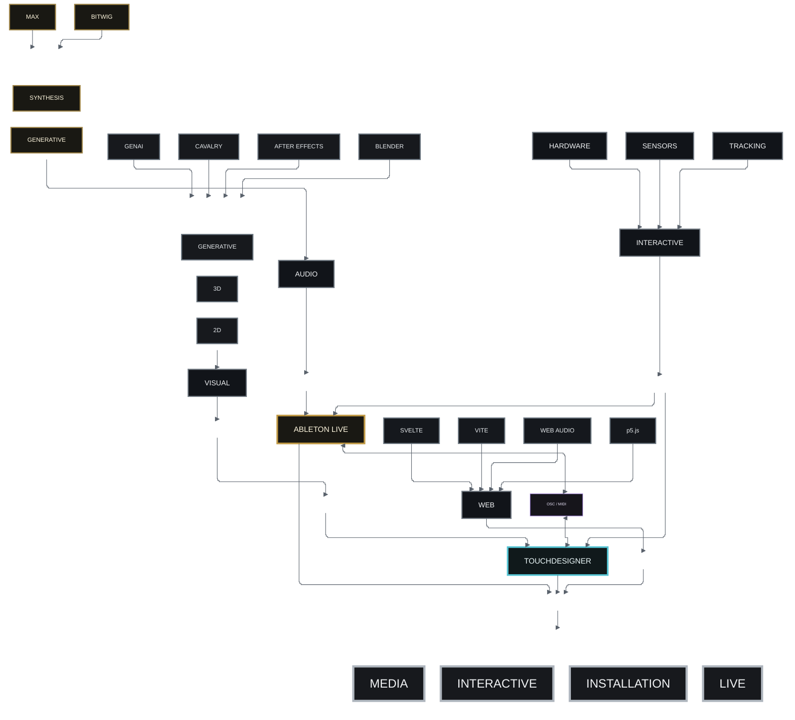

```mermaid

---
config:
  layout: elk
  elk:
    nodePlacementStrategy: BRANDES_KOEPF
    mergeEdges: false

  theme: base
  themeVariables:
    background: "#0d0f12"
    primaryColor: "#15181d"
    primaryTextColor: "#d7dbe0"
    primaryBorderColor: "#303640"
    lineColor: "#59616b"
    fontFamily: "Arial, Helvetica, sans-serif"
    fontSize: "13px"

  flowchart:
    curve: step
    nodeSpacing: 100
    rankSpacing: 100
---

flowchart TD

    %% =========================================================
    %% VISUAL
    %% =========================================================

    GENAI["GENAI"]
    CAVALRY["CAVALRY"]
    AE["AFTER EFFECTS"]
    BLENDER["BLENDER"]

    subgraph VISUAL_METHOD[" "]
        direction TB

        VISUAL_GENERATIVE["GENERATIVE"]
        VISUAL_3D["3D"]
        VISUAL_2D["2D"]

        VISUAL_GENERATIVE ~~~ VISUAL_3D
        VISUAL_3D ~~~ VISUAL_2D
    end

    VISUAL["VISUAL"]

    VISUAL_ANCHOR_1[" "]
    VISUAL_ANCHOR_2[" "]

    GENAI --> VISUAL_METHOD
    CAVALRY --> VISUAL_METHOD
    AE --> VISUAL_METHOD
    BLENDER --> VISUAL_METHOD

    VISUAL_METHOD --> VISUAL

    VISUAL --> VISUAL_ANCHOR_1
    VISUAL_ANCHOR_1 --> VISUAL_ANCHOR_2
    VISUAL_ANCHOR_2 --> TD


    %% =========================================================
    %% AUDIO
    %% =========================================================

    MAX["MAX"]
    BITWIG["BITWIG"]

    subgraph AUDIO_METHOD[" "]
        direction TB

        AUDIO_SYNTHESIS["SYNTHESIS"]
        AUDIO_GENERATIVE["GENERATIVE"]

        AUDIO_SYNTHESIS ~~~ AUDIO_GENERATIVE
    end

    AUDIO["AUDIO"]
    AUDIO_ANCHOR[" "]

    MAX --> AUDIO_METHOD
    BITWIG --> AUDIO_METHOD

    AUDIO_METHOD --> AUDIO
    AUDIO --> AUDIO_ANCHOR
    AUDIO_ANCHOR --> ABLETON


    %% =========================================================
    %% INTERACTIVE
    %% =========================================================

    HARDWARE["HARDWARE"]
    SENSORS["SENSORS"]
    TRACKING["TRACKING"]

    INTERACTIVE["INTERACTIVE"]
    INTERACTIVE_ANCHOR[" "]

    HARDWARE --> INTERACTIVE
    SENSORS --> INTERACTIVE
    TRACKING --> INTERACTIVE

    INTERACTIVE --> INTERACTIVE_ANCHOR

    INTERACTIVE_ANCHOR --> TD
    INTERACTIVE_ANCHOR --> ABLETON


    %% =========================================================
    %% WEB
    %% =========================================================

    SVELTE["SVELTE"]
    VITE["VITE"]
    WEB_AUDIO["WEB AUDIO"]
    P5["p5.js"]

    WEB["WEB"]
    WEB_ANCHOR[" "]

    SVELTE --> WEB
    VITE --> WEB
    WEB_AUDIO --> WEB
    P5 --> WEB

    WEB --> WEB_ANCHOR
    WEB_ANCHOR --> SIGNAL


    %% =========================================================
    %% CORE
    %% =========================================================

    TD["TOUCHDESIGNER"]
    ABLETON["ABLETON LIVE"]

    MID["OSC / MIDI"]

    ABLETON <--> MID
    MID <--> TD

    ABLETON ~~~ MID
    MID ~~~ TD


    %% =========================================================
    %% SIGNAL
    %% =========================================================

    SIGNAL[" "]

    TD --> SIGNAL
    ABLETON --> SIGNAL


    %% =========================================================
    %% OUTPUT
    %% =========================================================

    subgraph OUTPUT[" "]
        direction LR

        MEDIA["MEDIA"]
        INTERACTIVE_OUT["INTERACTIVE"]
        INSTALLATION["INSTALLATION"]
        LIVE["LIVE"]

        MEDIA ~~~ INTERACTIVE_OUT
        INTERACTIVE_OUT ~~~ INSTALLATION
        INSTALLATION ~~~ LIVE
    end

    SIGNAL --> OUTPUT


    %% =========================================================
    %% HIDDEN
    %% =========================================================

    style VISUAL_METHOD fill:none,stroke:none
    style AUDIO_METHOD fill:none,stroke:none

    style VISUAL_ANCHOR_1 fill:none,stroke:none
    style VISUAL_ANCHOR_2 fill:none,stroke:none
    style AUDIO_ANCHOR fill:none,stroke:none
    style INTERACTIVE_ANCHOR fill:none,stroke:none
    style WEB_ANCHOR fill:none,stroke:none
    style SIGNAL fill:none,stroke:none
    style OUTPUT fill:none,stroke:none


    %% =========================================================
    %% STYLES
    %% =========================================================

    classDef domain fill:#111419,stroke:#737b84,color:#f0f2f4,stroke-width:2px,font-size:13px;

    classDef visualTool fill:#17191d,stroke:#69747e,color:#e6eaed,stroke-width:2px,font-size:11px;
    classDef visualMethod fill:#17191d,stroke:#69747e,color:#e6eaed,stroke-width:2px,font-size:11px;

    classDef audioTool fill:#191813,stroke:#9c8245,color:#fff7df,stroke-width:2px,font-size:11px;
    classDef audioMethod fill:#191813,stroke:#9c8245,color:#fff7df,stroke-width:2px,font-size:11px;

    classDef coreTD fill:#10191b,stroke:#55c3d2,color:#eefbfc,stroke-width:3px,font-size:14px;
    classDef coreAudio fill:#191813,stroke:#c19a45,color:#fff7df,stroke-width:3px,font-size:14px;

    classDef communication fill:#16151b,stroke:#9b7bd3,color:#eee8ff,stroke-width:1px,font-size:7px;

    classDef webTool fill:#15181d,stroke:#69747e,color:#e6eaed,stroke-width:2px,font-size:11px;

    classDef output fill:#17191d,stroke:#aeb5bd,color:#f1f3f5,stroke-width:4px,font-size:22px;


    class VISUAL,AUDIO,INTERACTIVE,WEB domain;

    class GENAI,CAVALRY,AE,BLENDER visualTool;
    class VISUAL_GENERATIVE,VISUAL_3D,VISUAL_2D visualMethod;

    class MAX,BITWIG audioTool;
    class AUDIO_SYNTHESIS,AUDIO_GENERATIVE audioMethod;

    class HARDWARE,SENSORS,TRACKING domain;

    class SVELTE,VITE,WEB_AUDIO,P5 webTool;

    class TD coreTD;
    class ABLETON coreAudio;

    class MID communication;

    class MEDIA,INTERACTIVE_OUT,INSTALLATION,LIVE output;

```
