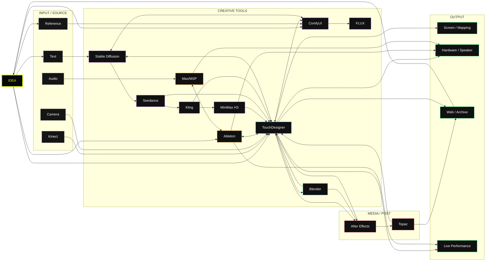

```mermaid

flowchart LR
    IDEA["IDEA"]

    subgraph INPUT["INPUT / SOURCE"]
        KINECT["Kinect"]
        CAMERA["Camera"]
        TEXT["Text"]
        AUDIOIN["Audio"]
        REFERENCE["Reference"]
    end

    subgraph CREATIVE["CREATIVE TOOLS"]
        TD["TouchDesigner"]
        ABLETON["Ableton"]
        MAX["Max/MSP"]

        COMFY["ComfyUI"]
        SD["Stable Diffusion"]
        FLUX["FLUX"]

        SEEDANCE["Seedance"]
        KLING["Kling"]
        H3["MiniMax H3"]

        BLENDER["Blender"]
    end

    subgraph POST["MEDIA / POST"]
        AE["After Effects"]
        TOPAZ["Topaz"]
    end

    subgraph OUTPUT["OUTPUT"]
        SCREEN["Screen / Mapping"]
        SPEAKER["Hardware / Speaker"]
        WEB["Web / Archive"]
        LIVE["Live Performance"]
    end


    IDEA --> TEXT
    IDEA --> REFERENCE
    IDEA --> ABLETON
    IDEA --> TD
    IDEA --> COMFY

    KINECT --> TD
    CAMERA --> TD
    AUDIOIN --> MAX

    TEXT --> SD
    REFERENCE --> COMFY

    MAX <--> ABLETON
    ABLETON <--> TD

    TD <--> COMFY
    TD <--> SD
    TD <--> BLENDER

    COMFY <--> SD
    COMFY --> FLUX

    SD --> SEEDANCE
    SEEDANCE --> KLING
    KLING --> H3

    H3 --> TD
    SEEDANCE --> TD
    KLING --> TD

    TD --> AE
    TD --> SCREEN
    TD --> SPEAKER
    TD --> LIVE

    ABLETON --> SPEAKER
    MAX --> SPEAKER

    AE --> TOPAZ
    TOPAZ --> TD
    TOPAZ --> WEB

    AE --> TD

    BLENDER --> TD
    BLENDER --> AE

    TD --> WEB
    ABLETON --> LIVE

    WEB --> IDEA

    classDef idea fill:#080808,stroke:#d9ff00,color:#d9ff00,stroke-width:3px;
    classDef input fill:#151515,stroke:#777,color:#fff;
    classDef audio fill:#111,stroke:#ff8a00,color:#fff;
    classDef visual fill:#111,stroke:#00d9ff,color:#fff;
    classDef ai fill:#111,stroke:#b56cff,color:#fff;
    classDef media fill:#111,stroke:#ff4d8d,color:#fff;
    classDef output fill:#111,stroke:#00ff88,color:#fff;

    class IDEA idea;
    class KINECT,CAMERA,TEXT,AUDIOIN,REFERENCE input;

    class ABLETON,MAX audio;
    class TD,BLENDER visual;
    class COMFY,SD,FLUX,SEEDANCE,KLING,H3 ai;
    class AE,TOPAZ media;
    class SCREEN,SPEAKER,WEB,LIVE output;
```
