

  <strong>0seconds</strong> 
  Artist & Developer exploring the intersection of 
  <strong>Audio · Visuals · AI · Interactive Systems</strong>

  
    Ableton Certified Training · DALL-E 2 · Midjourney · Runway Gen-1/2 Beta Tester 
    Ableton Live 12 Public Beta · Extensions SDK Developer Program
  

 

  

---

## Work

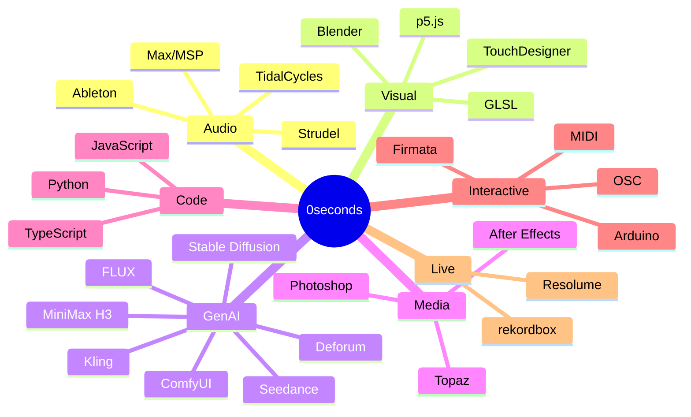

---

## Systems

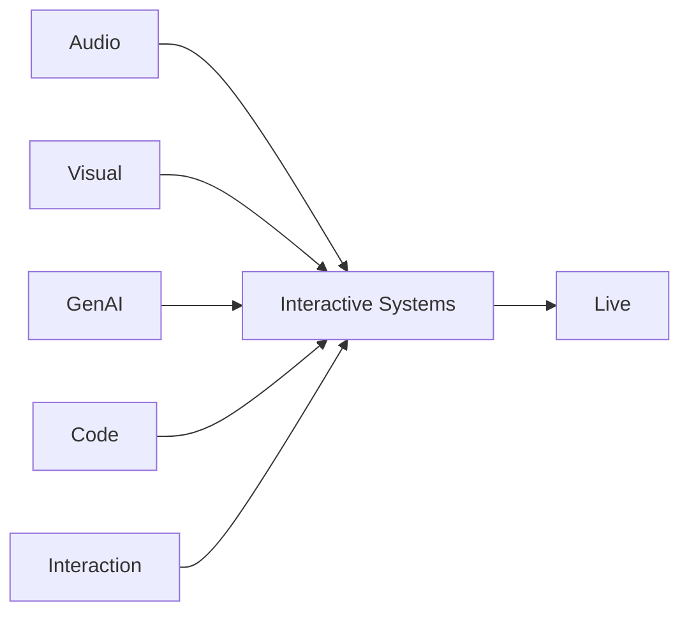

---

## Audio

  
  
  
  

Audio is treated as both a medium and a control signal.

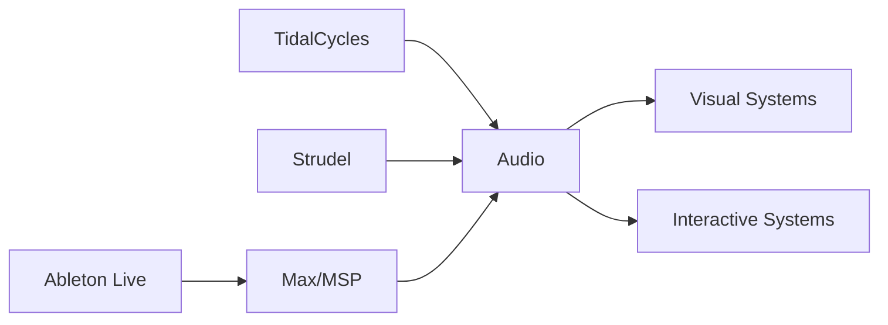

---

## Visual

  
  
  
  

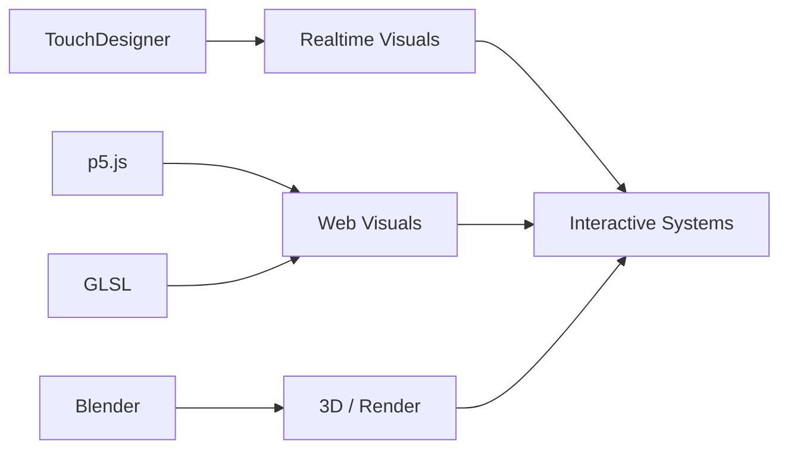

---

## GenAI

  
  
  
  
   
  
  
  

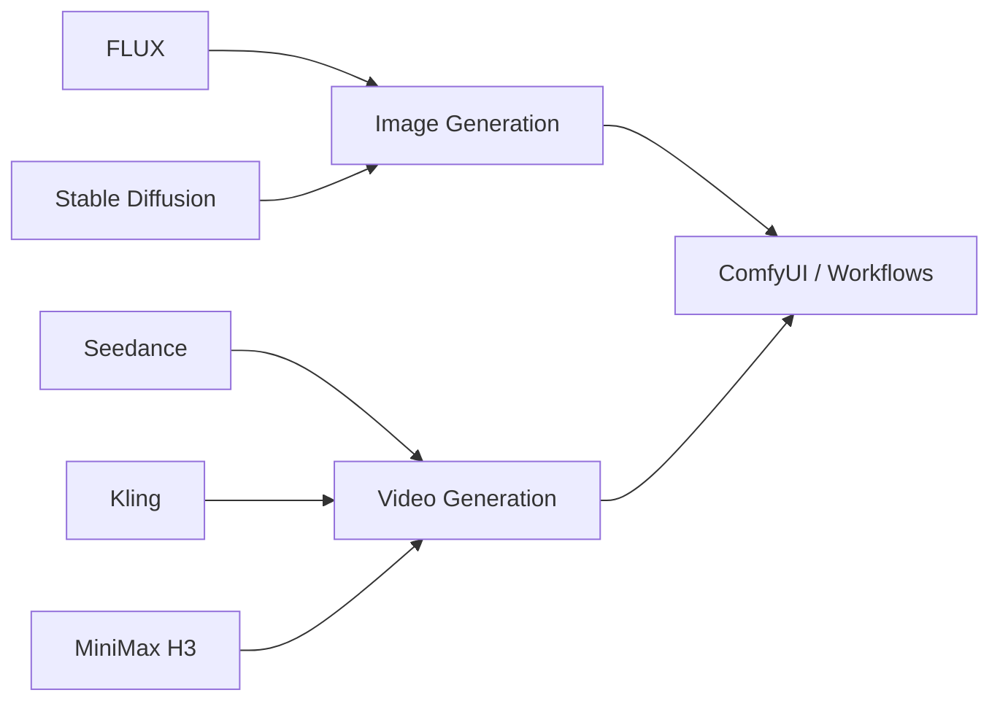

---

## Media

  
  
  

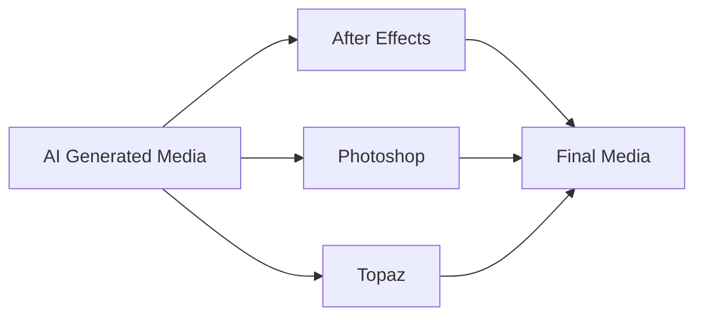

---

## Code

  
  
  

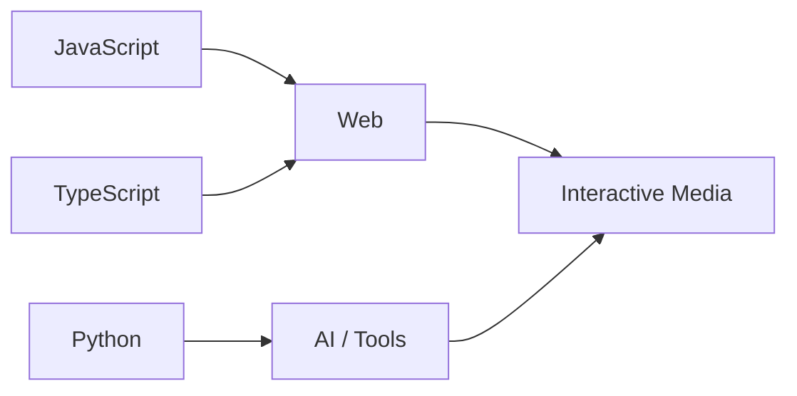

---

## Interactive

  
  
  
  

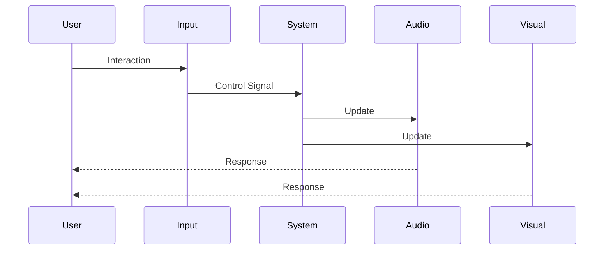

---

## Live

  
  

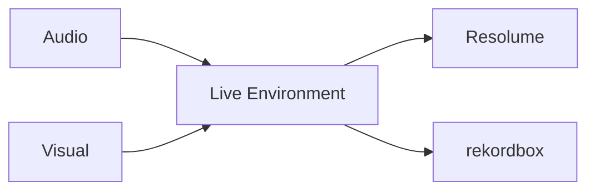

---

## Projects

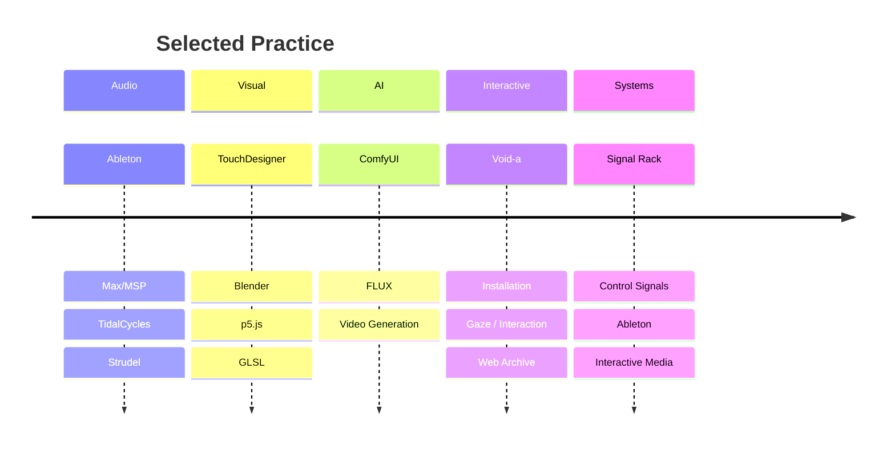

---

## Current Direction

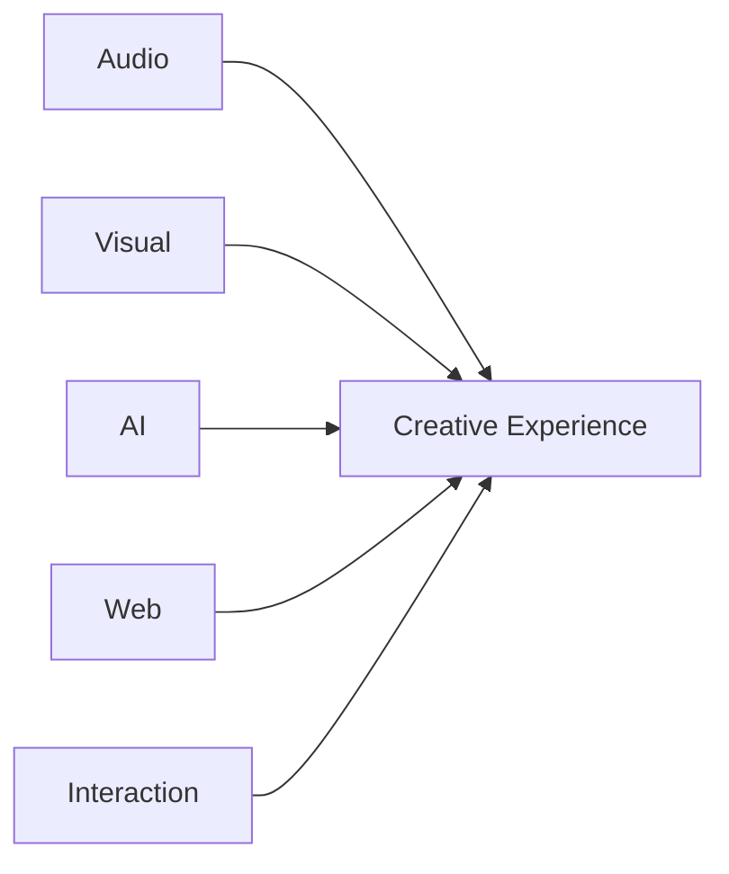

**Audio → Visual → AI → Code → Interaction**

The tools are different, but the direction is the same:

**building systems where sound, image, computation, and interaction become one medium.**

---

  
    0seconds · Artist / Developer
  

